<div align="center">

# 🩺 Sana — AI-Enabled Medical Assistant

**A full-stack Retrieval-Augmented Generation (RAG) system for medical question answering. It covers everything from research notebook to REST API to a Flutter mobile app.**


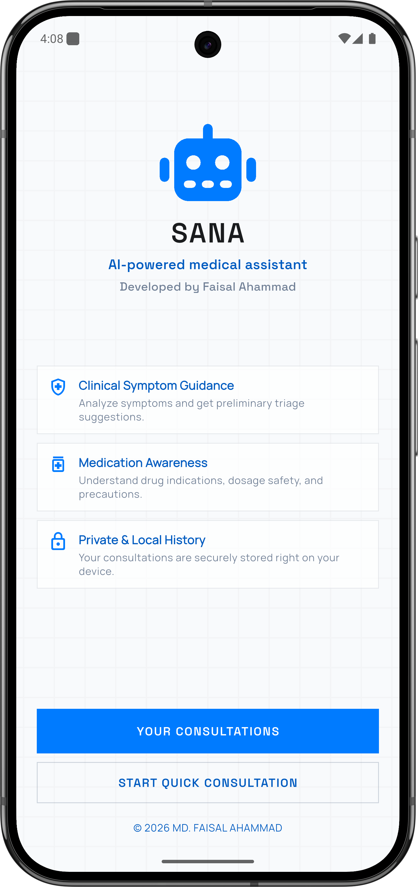 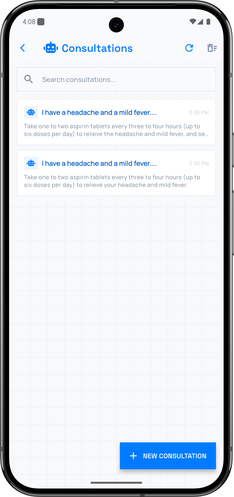 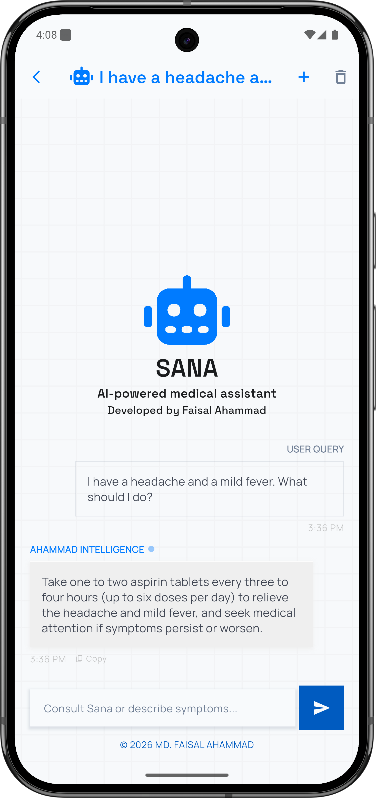

</div>

---

## 👤 Author

<table align="center">
  <tr>
    <td align="center" width="170">
      <a href="https://github.com/ahammaddev">
        
      </a>
    </td>
    <td>
      <h3>Md. Faisal Ahammad</h3>
      <b>Software Engineer</b> at <b>Impala Intech</b><br/>
      <sub>Building pixel perfect and problem solving app is my passion.</sub>
      <br/><br/>
      <a href="https://github.com/ahammaddev"></a>
      <a href="https://play.google.com/store/apps/developer?id=Faisal+Ahammad"></a>
      <a href="mailto:ahammad.labs@gmail.com"></a>
    </td>
  </tr>
</table>

<p align="center"><i>If Sana is useful to you, please consider giving it a ⭐. It helps others find the project.</i></p>

---

> [!WARNING]
> **Sana is an academic project and is not a medical device.** Its answers come from an LLM grounded in a single reference book, and they can be incomplete or wrong. Do not use it for diagnosis or treatment decisions. Always consult a qualified healthcare professional.

---

## 📑 Table of Contents

- [About the Project](#-about-the-project)
- [Features](#-features)
- [System Architecture](#-system-architecture)
- [Folder Structure](#-folder-structure)
- [How It Works](#-how-it-works)
  - [1. Knowledge Ingestion (Research Notebook)](#1-knowledge-ingestion-research-notebook)
  - [2. Question Answering (Backend)](#2-question-answering-backend)
  - [3. Mobile App Flow](#3-mobile-app-flow)
  - [4. End-to-End Request Sequence](#4-end-to-end-request-sequence)
- [Tech Stack](#-tech-stack)
- [Getting Started](#-getting-started)
  - [Prerequisites](#prerequisites)
  - [1. Build the Vector Index](#1-build-the-vector-index)
  - [2. Run the Backend](#2-run-the-backend)
  - [3. Run the Mobile App](#3-run-the-mobile-app)
- [API Reference](#-api-reference)
- [Configuration](#-configuration)
- [Evaluation](#-evaluation)
- [Deployment](#-deployment)
- [Testing](#-testing)
- [Known Limitations & Roadmap](#-known-limitations--roadmap)
- [Contributing](#-contributing)
- [License](#-license)

---

## 📖 About the Project

Sana ("health" in Spanish and Italian) was built by me in between **March and April 2026** as a course project for **Natural Language Processing**. The goal was to take an NLP idea from scratch to an app:

1. **Research.** In a Jupyter notebook, load a medical encyclopedia, split it into chunks, embed it, and store it in a vector database. Then build and evaluate a RAG chain.
2. **Backend.** Package the RAG chain as a small, deployable Flask API, hosted on a Hugging Face Space in Docker.
3. **Product.** Build a Flutter mobile app on top of the API, with conversation history stored on the device.

Sana doesn't rely only on what the LLM has memorised. Every answer is **grounded in passages retrieved** from the knowledge base (`data/Medical_book.pdf`, 637 pages, 5,859 chunks). The model is told to say _"I don't know"_ when the context doesn't cover the question.

---

## ✨ Features

| Area                        | Highlights                                                                                                                               |
| --------------------------- | ---------------------------------------------------------------------------------------------------------------------------------------- |
| **RAG pipeline**            | PDF ingestion → recursive chunking → sentence-transformer embeddings → Pinecone similarity search (top-k = 3) → Groq-hosted LLM          |
| **Grounded answers**        | The system prompt limits the model to the retrieved context. Answers are one concise sentence, and the model admits when it doesn't know |
| **REST API**                | Flask app factory, health check, and a single `/api/chat` endpoint with a friendly error message on failure                              |
| **Conversation memory**     | The app sends up to the 6 most recent Q&A exchanges (each trimmed to 600 chars) as context, so follow-up questions work                  |
| **Private, local history**  | All consultations are stored on the device in SQLite (`sqflite`). Nothing is stored on the server                                        |
| **Consultation management** | Create, search, reopen, delete, and clear consultations. Failed replies can be retried                                                   |
| **Resilience**              | Connectivity check before each request, 150 s timeout for slow cold starts, and per-message `failed` / `error` states                    |
| **Evaluation**              | BERTScore (DeBERTa-v3) evaluation of generated answers against reference answers                                                         |

---

## 🏗 System Architecture

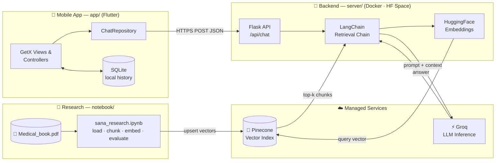

The system has three independent layers that share two contracts:

- **Notebook ↔ Backend: the Pinecone index.** The notebook writes vectors and the backend only reads them. Both **must use the same embedding model** (and therefore the same vector dimension) and the same index name.
- **Backend ↔ App: the JSON API.** `{"message": "..."}` in, `{"status": "...", "message": "..."}` out. The server is stateless. Conversation context is assembled by the app.

### Backend internals

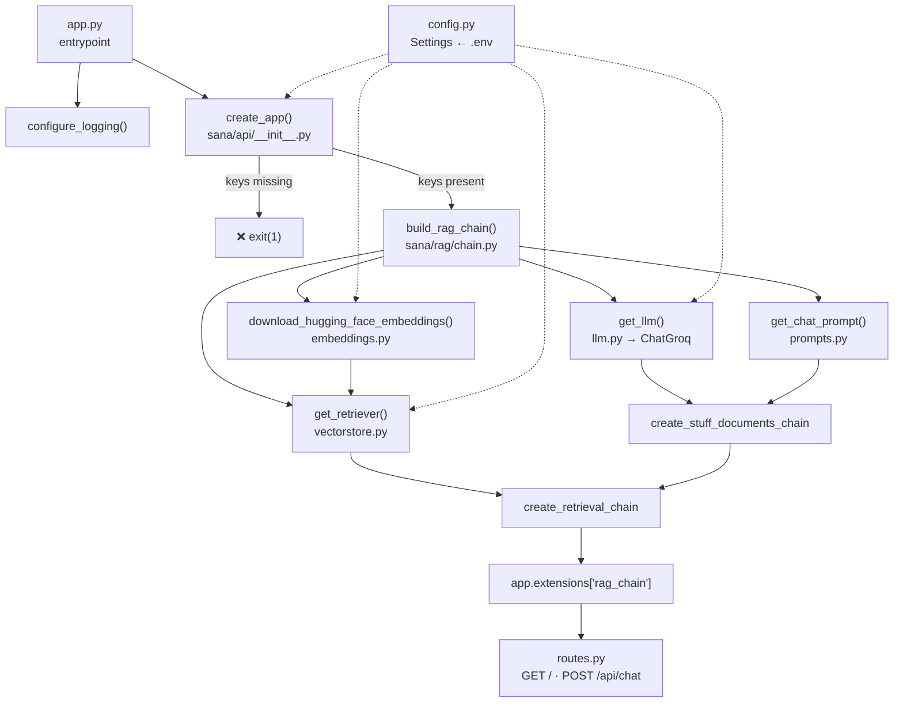

The chain is built **once at startup** and stored on the Flask app. `create_app(rag_chain=...)` accepts an injected `Runnable`, so routes can be tested with a stub, without API keys or model downloads.

### Mobile app internals

The Flutter app follows the **GetX** pattern: each feature module has a `binding` (dependency injection), a `controller` (reactive state), and `views` (widgets).

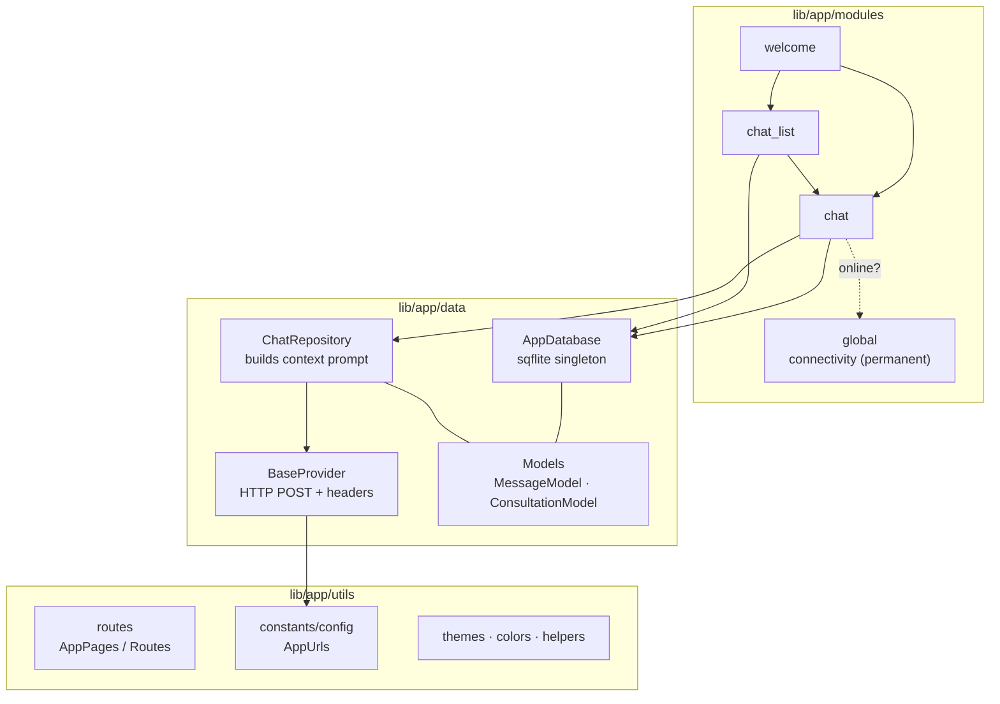

---

## 📂 Folder Structure

```text
sana-ai-enabled-medical-assistant/
├── data/
│   └── Medical_book.pdf          # Knowledge base (637 pages)
│
├── notebook/                     # 🔬 Research & ingestion
│   ├── sana_research.ipynb       # Load → chunk → embed → index → RAG → evaluate
│   └── requirements.txt          # Notebook extras (pypdf, evaluate, bert_score, …)
│
├── server/                       # 🐍 Backend API
│   ├── app.py                    # Entrypoint (used by Docker / HF Space)
│   ├── Dockerfile                # Python 3.11-slim, UID 1000, port 7860
│   ├── requirements.txt          # Runtime deps (Flask, LangChain 0.3.x, torch, …)
│   ├── setup.py
│   ├── .env.example              # PINECONE_API_KEY, GROQ_API_KEY
│   └── sana/
│       ├── config.py             # Frozen Settings dataclass loaded from env
│       ├── logger.py
│       ├── api/
│       │   ├── __init__.py       # create_app() factory
│       │   └── routes.py         # GET /  ·  POST /api/chat
│       └── rag/
│           ├── chain.py          # build_rag_chain()
│           ├── embeddings.py     # HuggingFace embeddings
│           ├── vectorstore.py    # Pinecone retriever
│           ├── llm.py            # ChatGroq client
│           └── prompts.py        # System prompt
│
├── app/                          # 📱 Flutter mobile app
│   ├── pubspec.yaml
│   ├── lib/
│   │   ├── main.dart             # GetMaterialApp bootstrap
│   │   └── app/
│   │       ├── data/
│   │       │   ├── models/       # MessageModel, ConsultationModel
│   │       │   ├── providers/    # BaseProvider (HTTP)
│   │       │   └── repository/   # ChatRepository (API), AppDatabase (SQLite)
│   │       ├── modules/          # GetX feature modules
│   │       │   ├── welcome/      #   landing screen
│   │       │   ├── chat_list/    #   consultation history + search
│   │       │   ├── chat/         #   conversation screen
│   │       │   └── global/       #   app-wide connectivity controller
│   │       └── utils/
│   │           ├── constants/    # colors, themes, config (AppUrls), helpers
│   │           └── routes/       # AppPages, Routes
│   ├── test/                     # Unit tests (models, context builder, dates)
│   └── android/ ios/ macos/ linux/
│
├── docs/                         # Screenshots
└── LICENSE                       # MIT
```

---

## ⚙️ How It Works

### 1. Knowledge Ingestion (Research Notebook)

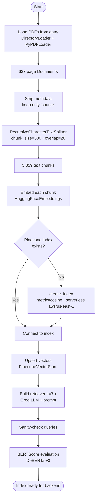

### 2. Question Answering (Backend)

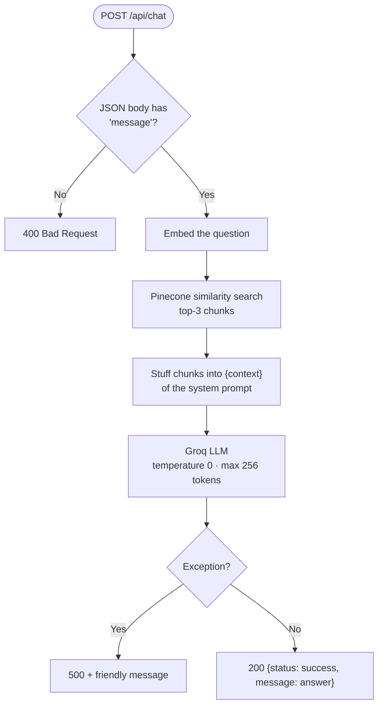

**System prompt** (`server/sana/rag/prompts.py`):

> You are an AI medical assistant for strict question-answering tasks. Use the following pieces of retrieved context to answer the question. If you don't know the answer, say that you don't know. Answer in exactly ONE sentence. Do not include background information, secondary causes, or potential complications unless explicitly asked. Output only the direct answer.
>
> `{context}`

### 3. Mobile App Flow

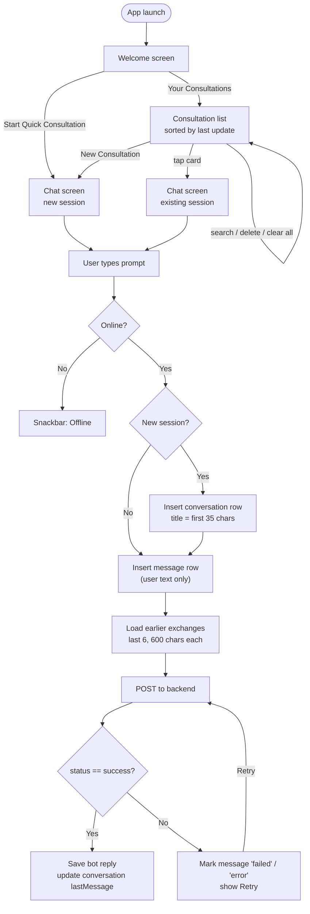

**Context window.** The backend is stateless, so `ChatRepository.buildPromptWithContext` turns earlier answered turns into the prompt:

```text
Previous conversation:
User: I have a headache and a mild fever.
Sana: Take one to two aspirin tablets ...

Current question: How often can I take it?
```

**Local database schema** (`app_database.db`, version 2):

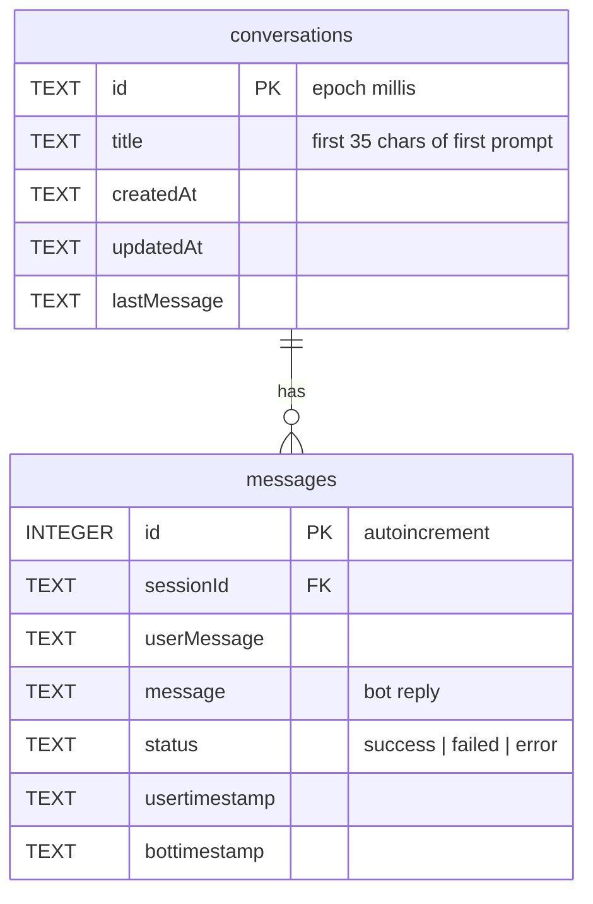

Upgrading from schema v1 moves any old, session-less messages into a `legacy_session` conversation.

### 4. End-to-End Request Sequence

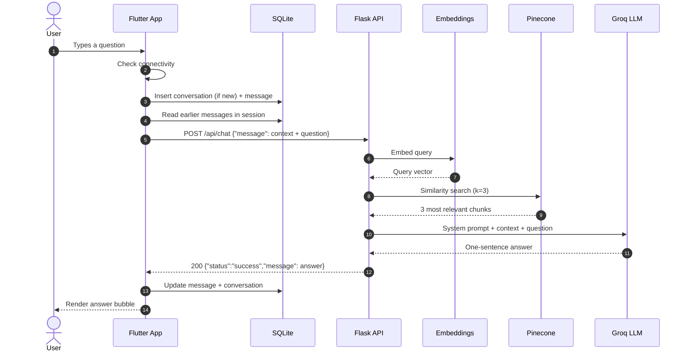

---

## 🧰 Tech Stack

| Layer             | Technology                                                                                                                                                    |
| ----------------- | ------------------------------------------------------------------------------------------------------------------------------------------------------------- |
| **Research**      | Jupyter, LangChain Community (`PyPDFLoader`, `DirectoryLoader`), `RecursiveCharacterTextSplitter`, Hugging Face `evaluate` + `bert_score`, matplotlib/seaborn |
| **Embeddings**    | `sentence-transformers` via `langchain-huggingface` (backend: `all-MiniLM-L6-v2`; notebook experiments: S-PubMedBERT, 768-d)                                  |
| **Vector DB**     | Pinecone serverless (cosine) via `langchain-pinecone`                                                                                                         |
| **LLM**           | Groq via `langchain-groq` (backend default `openai/gpt-oss-120b`; notebook used `llama-3.1-8b-instant`)                                                       |
| **Orchestration** | LangChain 0.3.x `create_retrieval_chain` + `create_stuff_documents_chain`                                                                                     |
| **Backend**       | Python 3.11, Flask, python-dotenv, Docker, Hugging Face Spaces                                                                                                |
| **Mobile**        | Flutter (Dart SDK ^3.11.4), GetX, `http`, `sqflite`, `connectivity_plus`, `google_fonts`, `font_awesome_flutter`, `intl`                                      |

---

## 🚀 Getting Started

### Prerequisites

- Python **3.10+** (3.11 recommended)
- Flutter SDK with Dart **3.11+**
- A free [Pinecone](https://www.pinecone.io/) account and API key
- A free [Groq](https://console.groq.com/) account and API key
- _(Optional)_ Docker and a [Hugging Face](https://huggingface.co/) account for deployment

```bash
git clone https://github.com/ahammaddev/sana-ai-enabled-medical-assistant.git
cd sana-ai-enabled-medical-assistant
```

### 1. Build the Vector Index

The backend reads from an **existing** Pinecone index. Create and fill it once with the notebook.

```bash
python -m venv .venv && source .venv/bin/activate
pip install -r server/requirements.txt -r notebook/requirements.txt
cp server/.env.example .env      # fill in PINECONE_API_KEY and GROQ_API_KEY
jupyter notebook notebook/sana_research.ipynb
```

In the notebook:

1. Set `LOCAL_EMBEDDING_PATH` to a local model directory, or replace it with a Hub model ID such as `sentence-transformers/all-MiniLM-L6-v2`.
2. Set `index_name` and a `dimension` that matches your embedding model (**384** for MiniLM-L6-v2, **768** for S-PubMedBERT).
3. Uncomment the `PineconeVectorStore.from_documents(...)` cell to upload the chunks. This only needs to run once.

> [!IMPORTANT]
> The backend uses the embedding model in `server/sana/config.py` (`embedding_model_name`) and the index named by `PINECONE_INDEX_NAME`. **Both must match what you used to build the index**, or retrieval will fail or return irrelevant chunks.

### 2. Run the Backend

```bash
cd server
pip install -r requirements.txt
cp .env.example .env              # add your keys
python app.py                     # → http://0.0.0.0:7860
```

Check that it works:

```bash
curl http://localhost:7860/
curl -X POST http://localhost:7860/api/chat \
     -H "Content-Type: application/json" \
     -d '{"message": "What is the primary treatment for acute appendicitis?"}'
```

The first start downloads the embedding model, so it may take a while.

### 3. Run the Mobile App

1. Point the app at your backend in `app/lib/app/utils/constants/config/app_urls.dart`:

   ```dart
   class AppUrls {
     AppUrls._();
     static String token = '<your Hugging Face token, only for a private Space>';
     static String url   = 'http://10.0.2.2:7860/api/chat'; // Android emulator → host
   }
   ```

   Use `http://localhost:7860/api/chat` on the iOS simulator, or your deployed Space URL (`https://<user>-<space>.hf.space/api/chat`).

2. Run it:

   ```bash
   cd app
   flutter pub get
   flutter run
   ```

> [!NOTE]
> Android blocks plain-HTTP traffic by default. For local HTTP testing, add `android:usesCleartextTraffic="true"` to the debug manifest, or use an HTTPS tunnel.

---

## 📡 API Reference

### `GET /` — Health check

```json
{ "status": "online", "service": "Sana Medical NLP API", "version": "1.0.0" }
```

### `POST /api/chat` — Ask a question

**Request**

```json
{ "message": "What is fever? What should we do if we feel fever?" }
```

**Responses**

| Code  | Body                                                                                                   |
| ----- | ------------------------------------------------------------------------------------------------------ |
| `200` | `{ "status": "success", "message": "<answer>" }`                                                       |
| `400` | `{ "status": "error", "message": "Bad Request: Missing 'message' in JSON body." }`                     |
| `500` | `{ "status": "error", "message": "The assistant is currently taking a nap. Please try again later!" }` |

---

## 🔧 Configuration

The backend reads all settings from environment variables, or from `server/.env`, through `server/sana/config.py`.

| Variable              | Default                  | Description                                    |
| --------------------- | ------------------------ | ---------------------------------------------- |
| `PINECONE_API_KEY`    | — _(required)_           | Pinecone API key                               |
| `GROQ_API_KEY`        | — _(required)_           | Groq API key                                   |
| `PINECONE_INDEX_NAME` | `medical-chatbot-faisal` | Index to query                                 |
| `GROQ_MODEL_ID`       | `openai/gpt-oss-120b`    | Any chat model served by Groq                  |
| `HOST`                | `0.0.0.0`                | Bind address                                   |
| `PORT`                | `7860`                   | Port (7860 is the Hugging Face Spaces default) |

Fixed in code (`Settings`): `embedding_model_name = sentence-transformers/all-MiniLM-L6-v2`, `retriever_k = 3`, `llm_temperature = 0.0`, `llm_max_tokens = 256`.

On the app side (`ChatRepository`), `maxContextExchanges = 6`, `maxContextChars = 600`, and the request timeout is 150 s.

---

## 📊 Evaluation

The notebook scores generated answers against reference answers with **BERTScore**, using `microsoft/deberta-v3-base` as the scoring model:

| Metric    | Score      |
| --------- | ---------- |
| Precision | 0.9175     |
| Recall    | 0.9523     |
| **F1**    | **0.9342** |

> [!NOTE]
> These scores come from a **small sanity-check set of 2 question/answer pairs** that were written during development. They show that the pipeline works end to end. They are **not** a benchmark of medical accuracy. A larger evaluation set, such as MedQuAD or PubMedQA, is a good first contribution.

---

## ☁️ Deployment

The backend runs as a **Docker Space on Hugging Face**. The Dockerfile uses `python:3.11-slim`, runs as UID 1000 (required by Spaces), and exposes port 7860.

The Dockerfile copies `server/`, so build it from the **repository root**:

```bash
docker build -f server/Dockerfile -t sana-api .
docker run -p 7860:7860 \
  -e PINECONE_API_KEY=... -e GROQ_API_KEY=... \
  sana-api
```

On Hugging Face Spaces, add `PINECONE_API_KEY` and `GROQ_API_KEY` as **Space secrets** instead of committing a `.env` file. If the Space is private, the app sends `Authorization: Bearer <AppUrls.token>` with each request.

---

## 🧪 Testing

**Mobile app.** Unit tests cover the models, the context-prompt builder, and date formatting:

```bash
cd app
flutter test                                  # all tests
flutter test test/data/chat_context_test.dart # a single file
flutter analyze                               # lints (flutter_lints)
```

**Backend.** There is no test suite yet. `create_app(rag_chain=stub)` makes route tests easy to write without network access.

---

## 🗺 Known Limitations & Roadmap

- [ ] **Single-source knowledge base.** Only one medical encyclopedia is indexed.
- [ ] **One-sentence answers** are short by design, and can leave out safety-relevant nuance.
- [ ] **Small evaluation set.** See [Evaluation](#-evaluation).
- [ ] Source citations in responses (the chain already returns the retrieved `context` documents).
- [ ] Streaming responses and multilingual (e.g. Bangla) support.

---

## 🤝 Contributing

Contributions are welcome.

1. Fork the repository and create a branch: `git checkout -b feature/my-feature`
2. Make your changes. Run `flutter analyze` / `flutter test` for app changes.
3. Commit with a clear message and open a Pull Request.

---

## 📄 License

Released under the [MIT License](LICENSE). © 2026 Md. Faisal Ahammad.

The PDF in `data/` is included for educational and research use. Check its original license before redistributing it.
